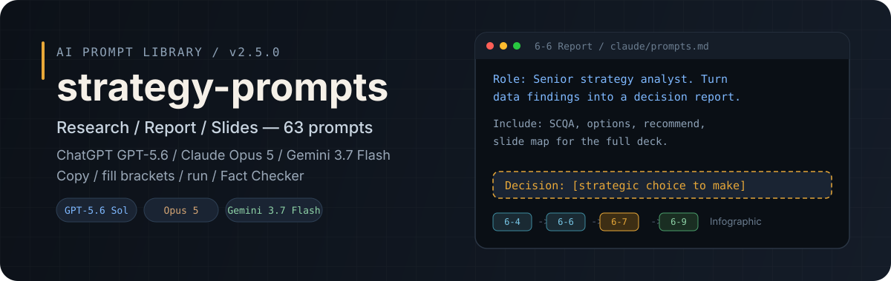
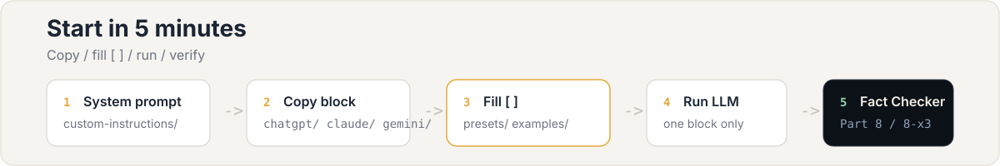

<p align="center">
  
</p>

<p align="center">
  <strong>v2.4.0</strong> · 한국어 해요체 · 프롬프트 <strong>57개</strong> (본 36 + 부록 21) · 2026년 8월 기준
</p>

<p align="center">
  ChatGPT <strong>GPT-5.6</strong> · Claude <strong>Opus 5</strong> · Gemini <strong>3.7 Flash</strong>에서 그대로 복사해 쓸 수 있는 업무 프레임워크 모음
</p>

---

## 이 레포가 하는 일

"전략 좀 짜줘"라고만 던지면 그럴듯하지만 회의에 가져가면 바로 걸리는 답이 나오는 경우가 많아요. 원인은 모델이 아니라 **뭘 알려줘야 하는지, 어떤 형태로 받을지**를 안 적어준 경우가 대부분이에요.

현장에서는 MECE로 문제를 쪼개고, SWOT으로 방향을 잡고, 채널 전략에서 예산을 나누는 식으로 **틀 안에서** 일합니다. 이 레포는 그 틀을 매번 새로 짜느라 쓰는 시간을 줄이기 위해, 자주 쓰는 프레임워크를 **복사 가능한 프롬프트**로 박아 둔 라이브러리예요.

| 잘 썼을 때 | 대충 썼을 때 |
|-----------|-------------|
| 표·우선순위가 잡힌 초안을 바로 팀에 넘길 수 있어요 | "좀 더 구체적으로요" 피드백만 쌓이고 결국 사람이 다시 씁니다 |

프롬프트는 LLM한테 넘기는 **업무 브리프**예요. 브리프가 탄탄할수록 결과물이 일에 더 가깝게 붙어요.

<p align="center">
  
</p>

### 바로 시작하기

1. (선택) [custom-instructions/](custom-instructions/)에서 쓰는 모델 시스템 프롬프트를 저장해요.
2. [INDEX.md](INDEX.md)나 아래 표에서 ID 하나를 고릅니다.
3. [chatgpt/](chatgpt/prompts.md) · [claude/](claude/prompts.md) · [gemini/](gemini/prompts.md)에서 **블록 하나만** 복사해요.
4. `[ ]` 안에 회사명·숫자·기한·제약을 채웁니다. [presets/](presets/) · [examples/](examples/) 참고.
5. LLM에 붙여 넣고 실행 → 같은 도메인 **Fact Checker**(8-x3)로 검증.

| 상황 | 시작 ID |
|------|---------|
| 문제가 뒤죽박죽 | **1-1** MECE |
| 이사회·경영 보고 | **1-3** → **1-12** |
| 채널·예산 | **2-1** |
| 보도자료 | **5-2** → **5-9** → **8-15** |
| 위기 대응 | **5-5** → **5-4** → **5-6** |
| GA4만 있음 | **6-1** → **8-18** → **6-3** |
| 분기 OKR | **7-1** |
| 프롬프트 손보기 | **8-x1** PE |
| 에이전트 설계 | **8-x2** Agent |

체인 전체: [workflows/WORKFLOWS.md](workflows/WORKFLOWS.md)

---

<p align="center">
  
</p>

## Part 한눈에 보기

| 지금 필요한 것 | Part | 대표 ID | 나오는 것 |
|-------------|------|---------|----------|
| 문제 정리·의사결정 | 1 전략 | 1-1 · 1-7 · 1-12 | 이슈 트리, SWOT, 이사회용 합성 |
| 채널·콘텐츠·광고 | 2 마케팅 | 2-1 · 2-3 | 채널 맵, 광고 운영안 |
| 매출·전환·재구매 | 3 커머스 | 3-1 · 3-2 | 가격·프로모, CRO |
| 캠페인·브리프 | 4 기획 | 4-2 · 4-3 · 4-1 | 아이디어 → 메시지 → 브리프 |
| 보도·위기·평판 | 5 PR | 5-2 · 5-4 · 5-9 | 보도자료, 위기 Q&A, 규제 체크 |
| 숫자 → 스토리 | 6 데이터 | 6-1 · 6-3 | GA4 해석, 경영 리포트 |
| 실행·조직 | 7 조직 | 7-1 · 7-3 | OKR, 90일 로드맵 |
| PE · Agent · 검증 | 8 부록 | 8-x1 · 8-x2 · 8-x3 | 프롬프트 개선, 에이전트, Fact Checker |

난이도·소요 시간·전체 ID 목록: [INDEX.md](INDEX.md)

**자주 쓰는 체인**: 전략 `1-1 → 1-7 → 1-12` · 보도 `5-2 → 5-9 → 8-15` · 데이터 `6-1 → 8-18 → 6-3`

---

## 모델 선택 (2026년 8월)

| 모델 | API ID | 파일 | 잘 맞는 일 |
|------|--------|------|-----------|
| **ChatGPT** | `gpt-5.6-sol` (Sol / Terra / Luna) | [chatgpt/prompts.md](chatgpt/prompts.md) | 표·리포트, outcome-first, Think 슬라이더 |
| **Claude** | `claude-opus-5` (Sonnet 5 병행) | [claude/prompts.md](claude/prompts.md) | 긴 맥락·추론, 위기·전략 합성, 1M 컨텍스트 |
| **Gemini** | `gemini-3.7-flash` | [gemini/prompts.md](gemini/prompts.md) | 빠른 초안, 아이디어, Antigravity 에이전트 |
| Perplexity | Pro | [perplexity/prompts.md](perplexity/prompts.md) | 산업·보도·벤치 (출처) |

| Part | ChatGPT | Claude | Gemini |
|------|---------|--------|--------|
| 1 전략 | Sol · 1-12 합성 | Opus 5 · effort high~xhigh | 1-1, 1-7 빠른 초안 |
| 2~3 마케팅·커머스 | Terra/Sol · KPI 표 | Opus 5 · CRO 우선순위 | 채널·퍼널 표 |
| 4 기획 | Luna→Sol 체인 | Sonnet 5 → Opus 5 | 4-2 아이디어 8~12안 |
| 5 PR | Sol · 5-2 보도자료 | Opus 5 · 5-4 위기 xhigh | 5-2 헤드라인 3안 |
| 6 데이터 | Sol · 6-3 리포트 | Opus 5 · 6-2 A/B | 6-1 GA4 대용량 |
| 7 조직 | Terra · 7-1 OKR | Opus 5 · RACI | 7-3 로드맵 표 |
| 8 부록 | Sol · Agent 설계 | Opus 5 · xhigh | 8-x2 Antigravity |

공식 가이드: [guides/MODEL_PROMPT_GUIDELINES.md](guides/MODEL_PROMPT_GUIDELINES.md) · [guides/CATEGORY_MODEL_TIPS.md](guides/CATEGORY_MODEL_TIPS.md)

---

## 구조와 문체

| | |
|---|---|
| 프롬프트 | 57개 (업무 36 + 부록 21) |
| 문체 | 한국어 해요체 (`~해요`, `~해 주세요`) |
| 본문 수정 | `prompts/ko/body.md` 한 곳 → `./scripts/build-prompts.sh` |
| 검증 | `./scripts/verify.sh` · Part 8 Fact Checker (8-x3) |

ChatGPT·Claude·Gemini 세 모델 모두 한국어 해요체 지시를 잘 따르는 편이라, 모델마다 문장을 갈라 두지 않고 **본문 하나**로 관리합니다. `You are`, `Deliver:` 같은 영문 템플릿은 일부러 빼 두었어요.

```
strategy-prompts/
├── prompts/ko/body.md          ← 내용 수정은 여기
├── assets/readme/              ← README 시각 에셋 (SVG)
├── chatgpt/ claude/ gemini/    ← 실제로 복사하는 prompts.md
├── custom-instructions/        ← 모델별 시스템 프롬프트
└── INDEX.md, workflows/, examples/, guides/, presets/
```

---

## 같이 보면 좋은 문서

| 필요할 때 | |
|----------|--|
| 전체 목차·난이도 | [INDEX.md](INDEX.md) |
| 입력 전 체크 | [guides/INPUT_CHECKLIST.md](guides/INPUT_CHECKLIST.md) |
| 채운 예시 | [examples/sample-input.md](examples/sample-input.md) · [before-after.md](examples/before-after.md) |
| 업종별 문장 | [presets/INDUSTRY_PRESETS.md](presets/INDUSTRY_PRESETS.md) |
| 모델 공식 가이드 | [guides/MODEL_PROMPT_GUIDELINES.md](guides/MODEL_PROMPT_GUIDELINES.md) |
| 워크플로 체인 | [workflows/WORKFLOWS.md](workflows/WORKFLOWS.md) |
| 수정·기여 | [STYLE_GUIDE.md](STYLE_GUIDE.md) · [CONTRIBUTING.md](CONTRIBUTING.md) |
| 변경 이력 | [CHANGELOG.md](CHANGELOG.md) |

---

## 기여

```bash
./scripts/build-prompts.sh
./scripts/verify.sh
```

Part 1의 12개 전략 프레임워크 **항목 구조**는 원본 의도대로 유지해 주시면 좋아요.

## 라이선스

[MIT License](LICENSE) — 자유롭게 쓰고 고치셔도 됩니다.
