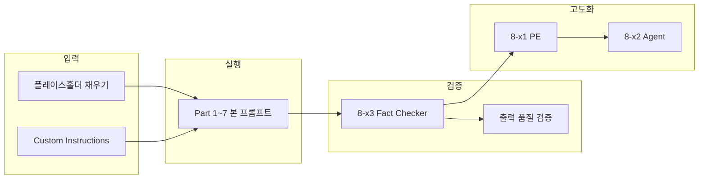
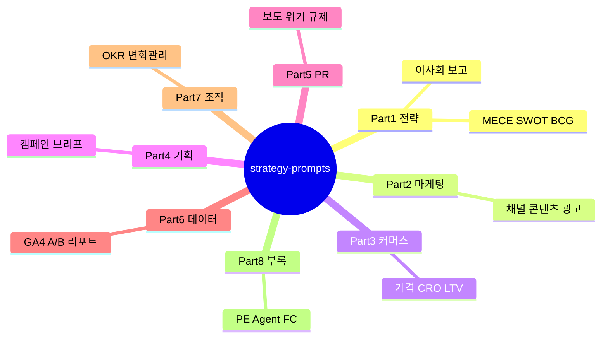

# 전략·마케팅·기획·PR 프롬프트 라이브러리

**v2.3.0** · 한국어 해요체 · 프롬프트 **57개** (본 36 + 부록 21)

ChatGPT 5.5, Claude Opus 4.8, Gemini 3.5 Flash, Perplexity Pro에서 그대로 복사해 쓸 수 있게 정리해 둔 모음이에요.


---

## 왜 프롬프트를 신경 써야 할까요

ChatGPT에 "전략 좀 짜줘"라고만 던지면, 읽을 때는 그럴듯한데 회의에 가져가면 바로 걸리는 답이 나오는 경우가 많아요. 모델 탓이라기보다, **뭘 알려줘야 하는지, 어떤 형태로 받을지**를 안 적어준 경우가 대부분이에요.

현장에서는 MECE로 문제를 쪼개고, SWOT으로 방향을 잡고, 채널 전략에서 예산을 나누는 식으로 **틀 안에서** 일합니다. 그 틀을 매번 새로 짜느라 시간 쓰지 않게, 자주 쓰는 프레임워크를 프롬프트로 박아 둔 게 이 레포예요.

프롬프트를 제대로 쓰면 이런 차이가 납니다.

- 잘 썼을 때: 표랑 우선순위가 잡힌 초안을 바로 팀에 넘길 수 있어요.
- 대충 썼을 때: "좀 더 구체적으로요"라는 피드백만 쌓이고, 결국 사람이 처음부터 다시 씁니다.

한마디로 말하면, 프롬프트는 LLM한테 넘기는 **업무 브리프**예요. 브리프가 탄탄할수록 결과물이 일에 더 가깝게 붙어요.

---

## 무엇에 쓰면 좋은지

"지금 뭐가 급한가"만 보면 Part 고르기가 쉬워요.

| 지금 필요한 것 | Part | 나오는 것 예시 |
|-------------|------|----------------|
| 문제 정리·의사결정 | 1 전략 | 이슈 트리, SWOT, 이사회용 요약 |
| 채널·콘텐츠·광고 | 2 마케팅 | 채널 맵, 콘텐츠 필러, 광고 운영안 |
| 매출·전환·재구매 | 3 커머스 | 가격·프로모, CRO, LTV 액션 |
| 캠페인·브리프 | 4 기획 | 아이디어 숏리스트, 크리에이티브 브리프 |
| 보도·위기·평판 | 5 PR | 보도자료, 피칭, 위기 Q&A, 규제 점검 |
| 숫자 → 스토리 | 6 데이터 | GA4 해석, A/B 결론, 경영 리포트 |
| 실행·조직 | 7 조직 | OKR, 스테이크홀더 맵, 90일 로드맵 |
| 프롬프트·에이전트 다듬기 | 8 부록 | PE, Agent 설계, Fact Check |

한 가지 일이 아니라 흐름이 이어지면 [workflows/WORKFLOWS.md](workflows/WORKFLOWS.md)에 있는 체인을 순서대로 쓰면 돼요. 예를 들어 전략은 `1-1 → 1-7 → 1-12`, 보도 배포는 `5-2 → 5-9 → 8-15`처럼요.

---

## 어떻게 쓰면 되는지

어렵게 생각할 필요 없어요. **복사하고, [ ] 채우고, 돌리고, 한번 검증** — 이 네 가지만 하면 됩니다.

1. 쓰는 LLM 폴더(`chatgpt/`, `claude/` 등)에서 `prompts.md`를 엽니다.
2. 필요한 프레임워크 **블록 하나만** 복사합니다. 여러 개 한꺼번에 붙이면 흐려져요.
3. `[ ]` 안에 회사명, 숫자, 기한, 제약을 **있는 그대로** 채웁니다. [examples/](examples/)랑 [presets/](presets/)에 참고용이 있어요.
4. LLM에 붙여 넣고 실행합니다. 자주 쓸 거면 [custom-instructions/](custom-instructions/)를 미리 깔아 두면 톤이 더 안정적이에요.
5. 답이 나오면 같은 도메인 **Fact Checker**(8-x3)로 한번 더 봅니다. 수치·보도·규제 쪽은 특히요.

이전 단계에서 받은 답을 통째로 다음 프롬프트에 붙이면, 체인으로 이을 때 훨씬 자연스럽습니다. 처음이면 맨 아래 **5분 시작 가이드** 표에서 하나 골라 타 보시면 감이 올 거예요.

---

## 왜 해요체로 썼는지

프롬프트 본문은 전부 **존댓말 해요체**(`~해요`, `~해 주세요`)로 맞춰 두었어요.

실무에서 동료한테 "이거 이렇게 정리해 줄 수 있어?"라고 부탁할 때 쓰는 말투에 가깝거든요. 그 톤으로 LLM한테 요청하면, 돌아오는 글도 보고서나 슬랙에 붙이기 덜 어색한 경우가 많아요. 지시가 반말이면 답도 가벼워지고, 지나친 격식체면 딱딱해지기도 하고요.

ChatGPT·Claude·Gemini·Perplexity 네 가지 모두 한국어 해요체 지시를 비교적 잘 따르는 편이라, 모델마다 문장을 갈라 두지 않고 **본문 하나**로 관리할 수 있게 했습니다. `You are`, `Deliver:` 같은 영문 템플릿은 일부러 빼 두었어요.

문체 규칙이 궁금하면 [STYLE_GUIDE.md](STYLE_GUIDE.md)를 보면 됩니다.

---

## 한눈에 보기

| | |
|---|---|
| 프롬프트 | 57개 (업무 36 + 부록 21) |
| 문체 | 한국어 해요체 |
| 모델 | 4종, 본문 동일 + 상단 가이드만 다름 |
| 수정 위치 | `prompts/ko/body.md` 한 곳 |
| 품질 보조 | Part 8 — Fact Checker · PE · Agent |



---

## v2에서 바뀐 것

| 버전 | 요약 |
|------|------|
| v2.0 | 전면 한글화, PR Part 추가, 빌드·검증 스크립트 |
| v2.1 | 데이터(Part 6)·조직(Part 7), 규제 체크, 예시·프리셋 |
| v2.2 | 부록(Part 8) — 도메인별 PE / Agent / Fact Checker |

자세한 건 [CHANGELOG.md](CHANGELOG.md)에 있어요.

---

## 도메인 맵



---

## 도메인별로 보면

ID·난이도·소요 시간은 [INDEX.md](INDEX.md)에 정리돼 있어요. 여기서는 **누가, 언제, 어떻게 이어 쓰면 편한지**만 짚을게요.

### Part 1 · 전략 (12개)

전략가, PM, 경영기획 쪽에서 가장 많이 씁니다. 문제가 막연할 때 **1-1 MECE**로 시작하고, 방향은 **1-7 SWOT**, 보고용 스토리는 **1-3 SCQA**, 마지막에 **1-12**로 모으는 패턴이 무난해요. 권고가 뭉뚱그려지면 **1-8 So What?** 한 번 거치면 좋아요.

| | |
|---|---|
| 자주 쓰는 ID | 1-1 · 1-7 · 1-3 · 1-12 |
| 이어 쓰기 | 1-1 → 1-7 → 1-8 → 1-5 → 1-12 |
| 부록 | 8-1 PE · 8-2 Agent · 8-3 Fact Checker |
| 채울 때 | 산업, 수치, 결정 기한은 구체적으로. 이전 답변은 통째로 붙이기 |
| 모델 | 긴 맥락은 Claude, 표 정리는 ChatGPT, 산업 데이터는 Perplexity |

---

### Part 2 · 디지털 마케팅 (3개)

퍼포먼스·브랜드·그로스 마케터용이에요. **2-1**에서 채널이랑 예산 뼈대를 먼저 잡아야 **2-2** 콘텐츠, **2-3** 광고가 안 흔들려요. KPI는 "인지/리드/매출" 중 하나만 골라 적는 게 좋습니다.

| | |
|---|---|
| 자주 쓰는 ID | 2-1 · 2-2 · 2-3 |
| 이어 쓰기 | 2-1 → 2-2 → 2-3 (캠페인이면 4-1과 연결) |
| 부록 | 8-4 · 8-5 · 8-6 |
| 채울 때 | 월 예산, CPA/ROAS 같은 **숫자**가 있으면 훨씬 낫습니다 |
| 모델 | 벤치·동향은 Perplexity, 빠른 초안은 Gemini |

---

### Part 3 · 커머스 (3개)

MD, D2C·마켓 운영하시는 분들이 씁니다. 자사몰/오픈마켓/소셜 비중이랑 전환·재구매 숫자를 같이 넣어 주세요. 채널마다 역할(물량 vs 마진 vs 신규)을 나눠 적으면 **3-2** CRO랑 **3-3** 재고·LTV가 맞물려요.

| | |
|---|---|
| 자주 쓰는 ID | 3-1 · 3-2 · 3-3 |
| 이어 쓰기 | 3-1 → 3-2 → 3-3 |
| 부록 | 8-7 · 8-8 · 8-9 |
| 모델 | 퍼널 표는 ChatGPT, 카테고리 벤치는 Perplexity |

---

### Part 4 · 기획·아이디어 (3개)

캠페인·크리에이티브 기획할 때요. **4-2**에서 아이디어를 넉넉히 뽑고, **4-3**에서 메시지를 고정한 다음 **4-1**로 실행 브리프를 만드는 순서가 익숙한 흐름이에요.

| | |
|---|---|
| 자주 쓰는 ID | 4-2 · 4-3 · 4-1 |
| 이어 쓰기 | 4-2 → 4-3 → 2-1 → 4-1 |
| 부록 | 8-10 · 8-11 · 8-12 |
| 채울 때 | 타깃 한 줄, 브랜드 금지어, 예산·채널 제약 |
| 모델 | 아이디어 폭은 Claude, 빠른 12안은 Gemini |

---

### Part 5 · PR·커뮤니케이션 (9개)

보도, IR, 위기 대응 담당자용입니다. 네이버·다음, 경제지, IT 전문지 맥락을 반영해 두었어요. 배포 전에 **5-9** 규제 체크랑 **8-15** Fact Checker를 거치는 걸 습관으로 두면 사고가 줄어요.

| | |
|---|---|
| 자주 쓰는 ID | 5-2 · 5-3 · 5-4 · 5-9 |
| 이어 쓰기 | 5-7 → 5-1 → 5-2 → 5-9 → 5-3 / 위기는 5-5 → 5-4 → 5-6 |
| 부록 | 8-13 · 8-14 · **8-15** |
| 채울 때 | 검증 가능한 팩트, 희망 매체, 배포 시점 |
| 모델 | 보도·팩트는 Perplexity, 성명·Q&A는 Claude |

---

### Part 6 · 데이터·분석 (3개)

GA4 숫자만 있고 말이 안 나올 때 **6-1**, A/B 결과로 결론 못 내리면 **6-2**, 경영진에 올릴 스토리는 **6-3**입니다. LLM이 없는 수치를 지어내지 않게 짜여 있지만, **8-18**으로 한번 더 보고 올리는 걸 권해요.

| | |
|---|---|
| 자주 쓰는 ID | 6-1 · 6-2 · 6-3 |
| 이어 쓰기 | 6-1 → 8-18 → 6-3 |
| 부록 | 8-16 · 8-17 · 8-18 |
| 채울 때 | 원시 표·스크린샷, 기간, 지표 정의 |
| 모델 | 수치·논리는 Claude, 리포트 초안은 ChatGPT |

---

### Part 7 · 조직·실행 (3개)

분기 OKR 짤 때 **7-1**, 이해관계자 맞출 때 **7-2**, 변화관리 로드맵은 **7-3**이에요. Part 1에서 전략 방향을 잡아 둔 뒤 쓰면 OKR이 허공에 뜨지 않아요.

| | |
|---|---|
| 자주 쓰는 ID | 7-1 · 7-2 · 7-3 |
| 이어 쓰기 | 1-12(또는 1-7) → 7-1 → 7-2 → 7-3 |
| 부록 | 8-19 · 8-20 · 8-21 |
| 채울 때 | 조직 규모, 막히는 지점을 솔직하게 |
| 모델 | RACI·로드맵은 ChatGPT, 커뮤니케이션은 Claude |

---

### Part 8 · 부록 (21개)

본 프롬프트 말고, **프롬프트 자체를 다듬거나(PE), 에이전트를 설계하거나(Agent), 답을 검증(Fact Checker)** 할 때 씁니다. 같은 도메인 부록을 쓰는 게 맞아요 — 전략 분석 뒤엔 8-3, PR 초안 뒤엔 8-15.

| 도메인 | PE | Agent | Fact Checker |
|--------|:--:|:-----:|:------------:|
| 전략 | 8-1 | 8-2 | 8-3 |
| 마케팅 | 8-4 | 8-5 | 8-6 |
| 커머스 | 8-7 | 8-8 | 8-9 |
| 기획 | 8-10 | 8-11 | 8-12 |
| PR | 8-13 | 8-14 | 8-15 |
| 데이터 | 8-16 | 8-17 | 8-18 |
| 조직 | 8-19 | 8-20 | 8-21 |

---

## 5분이면 시작할 수 있어요

```
① (선택) custom-instructions/ 에서 모델 시스템 프롬프트 저장
② INDEX.md나 아래 표에서 ID 하나 고르기
③ 해당 모델 prompts.md에서 블록 하나 복사
④ [ ] 채우기 — presets/, examples/before-after.md 참고
⑤ 실행 → 8-x3 Fact Checker → 필요하면 workflows 검증 프롬프트
```

| 상황 | ID |
|------|-----|
| 문제가 뒤죽박죽 | **1-1** |
| 이사회·경영 보고 | **1-3** → **1-12** |
| 채널·예산 | **2-1** |
| 보도자료 | **5-2** → **5-9** → **8-15** |
| 위기 | **5-5** → **5-4** → **5-6** |
| GA4만 있음 | **6-1** → **8-18** → **6-3** |
| 분기 OKR | **7-1** |
| 프롬프트 손보기 | **8-x1** |
| 에이전트 설계 | **8-x2** |

체인 전체는 [workflows/WORKFLOWS.md](workflows/WORKFLOWS.md)를 보시면 됩니다.

---

## 모델은 이렇게 고르면 돼요

| 모델 | API ID | 파일 | 잘 맞는 일 |
|------|--------|------|-----------|
| ChatGPT | `gpt-5.5` | [chatgpt/prompts.md](chatgpt/prompts.md) | 표·리포트, outcome-first 구조 |
| Claude | `claude-opus-4-8` | [claude/prompts.md](claude/prompts.md) | 긴 맥락·추론, 위기·전략 합성 |
| Gemini | `gemini-3.5-flash` | [gemini/prompts.md](gemini/prompts.md) | 빠른 초안, 아이디어·에이전트 |
| Perplexity | Pro | [perplexity/prompts.md](perplexity/prompts.md) | 산업·보도·벤치 (출처) |

**공식 가이드 + 카테고리별 팁**: [guides/MODEL_PROMPT_GUIDELINES.md](guides/MODEL_PROMPT_GUIDELINES.md) · [guides/CATEGORY_MODEL_TIPS.md](guides/CATEGORY_MODEL_TIPS.md)

시스템 프롬프트: [custom-instructions/](custom-instructions/) · 모델 비교: [testing/GOLDEN_SAMPLES.md](testing/GOLDEN_SAMPLES.md)

---

## 같이 보면 좋은 문서

| 필요할 때 | |
|----------|--|
| 전체 목차 | [INDEX.md](INDEX.md) |
| 입력 전 체크 | [guides/INPUT_CHECKLIST.md](guides/INPUT_CHECKLIST.md) |
| 채운 예시 | [examples/sample-input.md](examples/sample-input.md), [before-after.md](examples/before-after.md) |
| 업종별 문장 | [presets/INDUSTRY_PRESETS.md](presets/INDUSTRY_PRESETS.md) |
| **모델 공식 가이드** | [guides/MODEL_PROMPT_GUIDELINES.md](guides/MODEL_PROMPT_GUIDELINES.md) |
| **카테고리별 3모델 팁** | [guides/CATEGORY_MODEL_TIPS.md](guides/CATEGORY_MODEL_TIPS.md) |
| Notion/Obsidian | [guides/NOTION_OBSIDIAN.md](guides/NOTION_OBSIDIAN.md) |
| 수정·기여 | [STYLE_GUIDE.md](STYLE_GUIDE.md), [CONTRIBUTING.md](CONTRIBUTING.md) |

---

## 폴더 구조

```
strategy-prompts/
├── prompts/ko/body.md       ← 내용 수정은 여기
├── scripts/build-prompts.sh
├── scripts/verify.sh
├── chatgpt/ claude/ gemini/ perplexity/   ← 실제로 복사하는 파일
└── INDEX.md, workflows/, examples/, guides/, custom-instructions/
```

---

## 기여하실 때

```bash
./scripts/build-prompts.sh
./scripts/verify.sh
```

---

## 라이선스

[MIT License](LICENSE) — 자유롭게 쓰고 고치셔도 됩니다. Part 1의 12개 전략 프레임워크 **항목 구조**만 원본 의도대로 유지해 주시면 좋아요.
